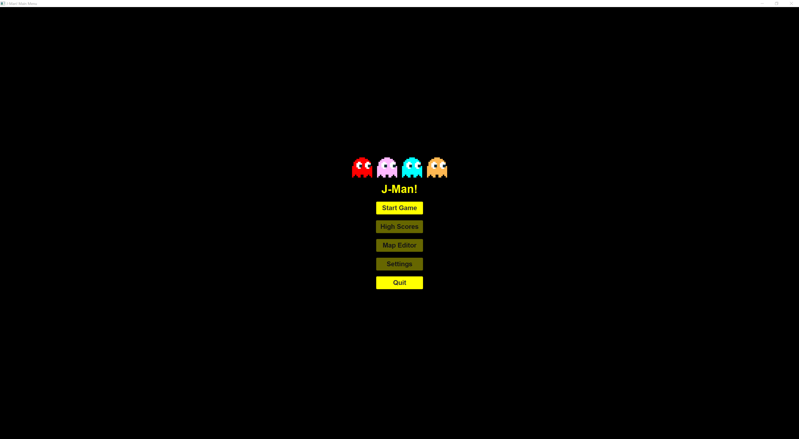
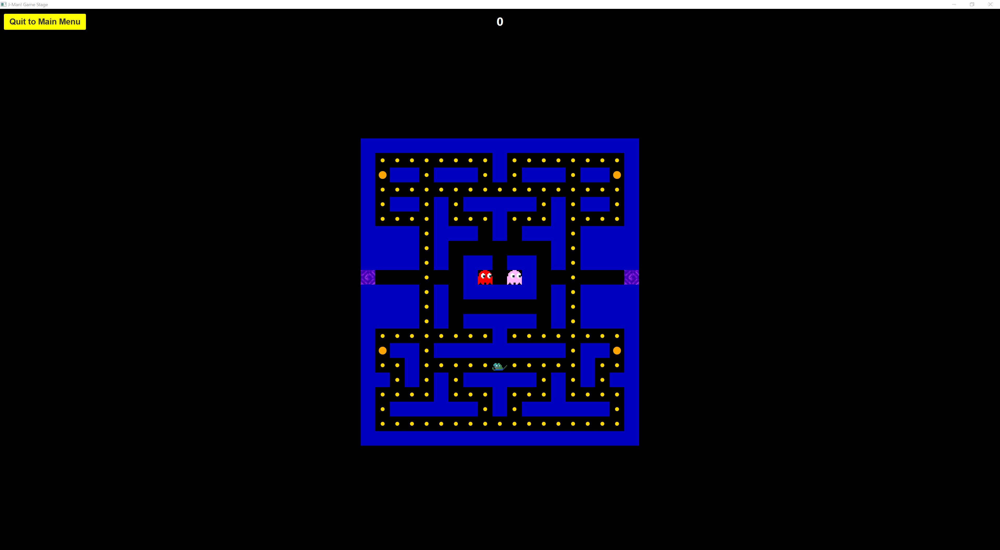
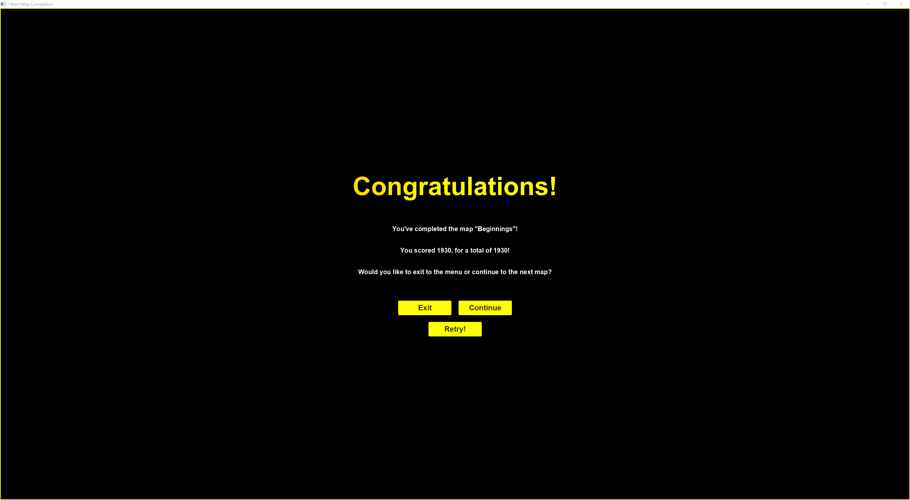
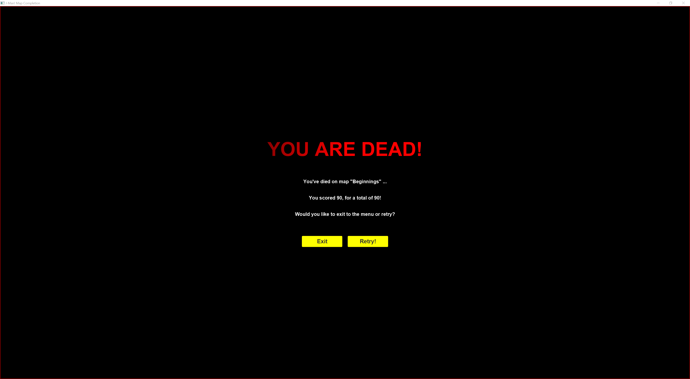
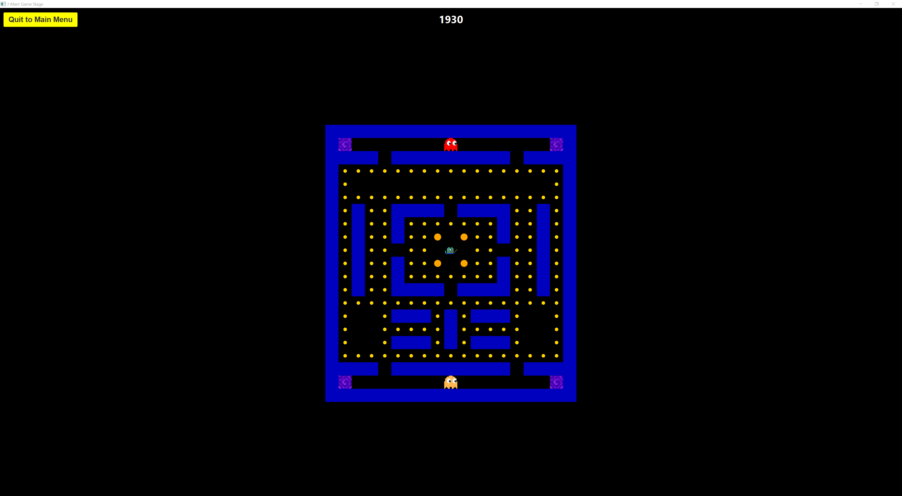
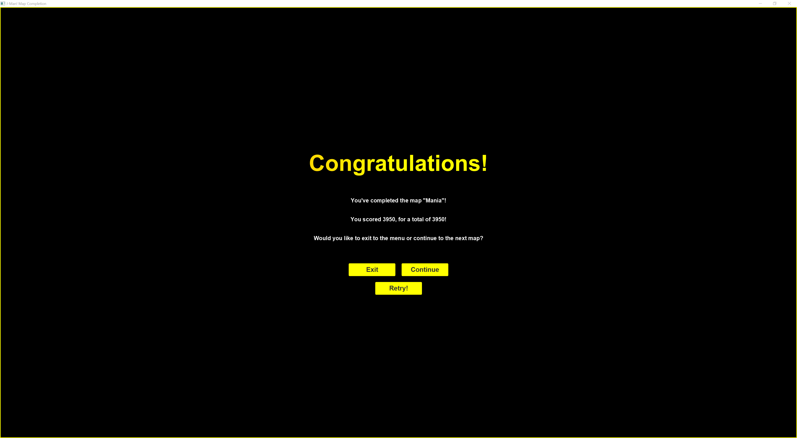
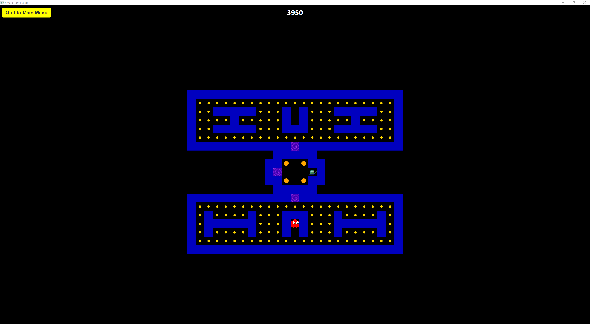

# J-Man

J-Man is a [Pac-Man](https://en.wikipedia.org/wiki/Pac-Man) clone created as part of the study plan imposed by the class OBJ2100 at the University of South-Eastern Norway.

> :warning: **This is a mixed-language repository.** You may come across usage of Norwegian in places, but primarily the project _should_ be in English.

It's not _fully_ feature complete, but it's mostly there. Though, as a fair warning; do note that there's a lot of spaghetti code and some disgusting hacks and possibly some eye-bleeding abominations as well.

Playing is very simple:
- To start, press the down arrow key: <kbd>↓</kbd>
- Then move with the arrow keys.
- Once you've consumed all pellets and power-ups, enter a teleport tile to move to the map completion screen.

Don't expect things to be very balanced though.

-----

<details>
<summary>Design</summary>

## Example images
### Main Menu


### Map 1: Beginnings




### Map 2: Mania



### Map 3: Electric Boogaloo


There's a second spawn in the box in the top area, but ironically, this run no Ghosts spawned there.

## Map data
Map file and its data is very simple.

The Map basename must be prefixed with `map`, appended with a number higher than the one before (e.g. 1, 2, 3, etc.) and finally suffixed with `.level` for the game to recognize it. Example: `map1.level` and then `map2.level`.

The first line is the name of the level, and the rest is the map itself. It uses singular letters and numbers with a space between them to define parts of the map.

The width of the map is defined by the first line, which does mean it also limits the design of the map, but it's the simpler solution. Which is why I chose it.

The height of the map is defined by the amount of lines after the title, disregarding any empty lines.

An alternative mapdata format was considered, but wasn't implemented due to time constraints. Below is an example of it. It would've allowed for a more flexible map design, and is easier to parse when looking at the filedata directly. Even if it's more cumbersome to make this way. The benefit of this, would be that it'd be easier to find "corners" and render them correctly without needing to calculate and/or check its neighbors. Thus allowing for a less blocky design.

```plaintext
Title
┏━━━━━━━━┳━━━━━━━━┓
┃········┃········┃
┃•━━·━━━·╹·━━━·━━•┃
┃·················┃
┃·━━·╻·━━┳━━·╻·━━·┃
┃····┃···┃···┃····┃
┗━━┓·┣━━ ╹ ━━┫·┏━━┛
   ┃·┃       ┃·┃
━━━┛·╹ ┏━ ━┓ ╹·┗━━━
←   ·  ┃ G ┃  ·   →
━━━┓·╻ ┗━━━┛ ╻·┏━━━
   ┃·┃       ┃·┃
┏━━┛·╹ ━━┳━━ ╹·┗━━┓
┃········┃········┃
┃•━┓·━━━━┻━━━━·┏━•┃
┃··┃·····P·····┃··┃
┣━·╹·╻·━━┳━━·╻·╹·━┫
┃····┃···┃···┃····┃
┃·━━━┻━━·╹·━━┻━━━·┃
┃·················┃
┗━━━━━━━━━━━━━━━━━┛
```

</details>
